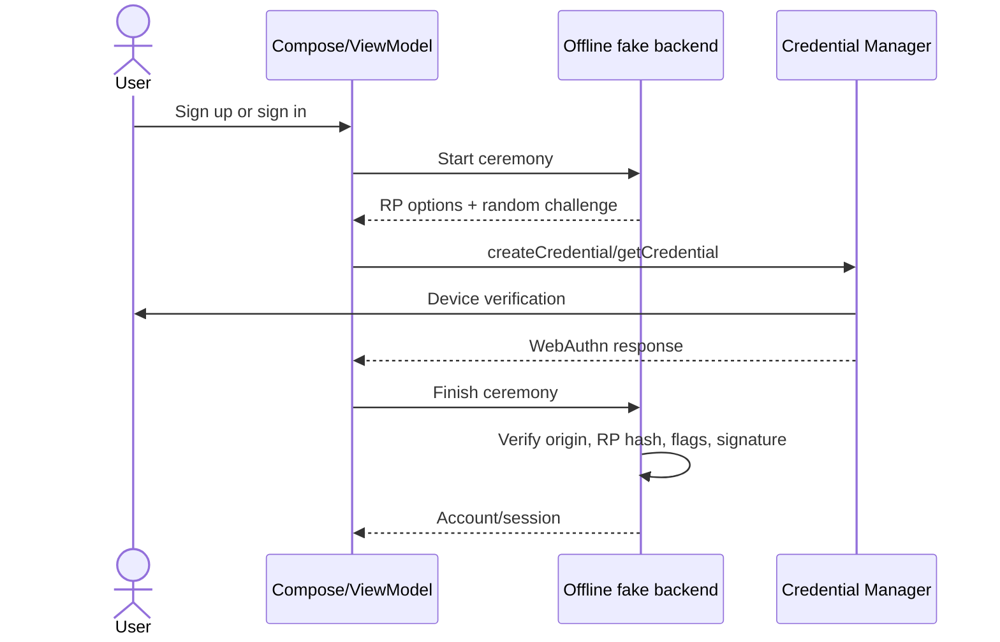

# Plan, definition, and design

## Goal

Teach an Android developer the complete passkey lifecycle without requiring a separate server project. The code should remain small enough to trace in a debugger while preserving the security checks that explain why a passkey works.

## Functional scope

- Create a local account using display name and email.
- Ask Credential Manager to create a discoverable passkey.
- Save the credential ID, user ID, public key, and signature counter.
- Sign in without typing an email.
- Resolve the account from the returned credential ID.
- Verify the assertion and create an in-memory signed-in session.
- Sign out and clear the fake backend database.

## Ceremony design

## Registration data

The private key never enters this app. The credential provider stores it. Registration returns an attestation object containing the public key. The fake backend extracts that ES256/P-256 key from COSE/CBOR and stores it as an X.509-encoded public key.

The backend accepts registration only when:

- `clientDataJSON.type` is `webauthn.create`;
- the returned challenge equals the current, unexpired challenge;
- the native Android origin equals this APK's signing-certificate origin;
- `SHA-256(RP ID)` equals the authenticator's RP-ID hash;
- user-present, user-verified, and attested-data flags are set;
- the returned credential ID matches the attested credential ID;
- the key is an ES256 key on P-256; and
- the requested no-attestation format is returned.

## Authentication data

The backend locates the account by credential ID, then verifies:

- `clientDataJSON.type` is `webauthn.get`;
- challenge, origin, RP-ID hash, user-present and user-verified values;
- user handle, when the provider returns one;
- the ECDSA signature over `authenticatorData || SHA-256(clientDataJSON)`; and
- the signature counter when the authenticator supports one.

## Why the HTTPS domain is still required

The fake backend removes the need to run an API, but it cannot replace Android's trust association. Credential Manager must know that the signed APK is allowed to act for the RP ID. It checks the RP domain's public Digital Asset Links file. That file is configuration, not an authentication API.

## Production boundary

This verifier is deliberately local so its behavior is observable. It is not a deployable security boundary: attackers control their own APK process and local storage. Move `FakePasskeyBackend` and `WebAuthnVerifier` to a trusted server or adopt a mature server-side WebAuthn library before using real accounts.
